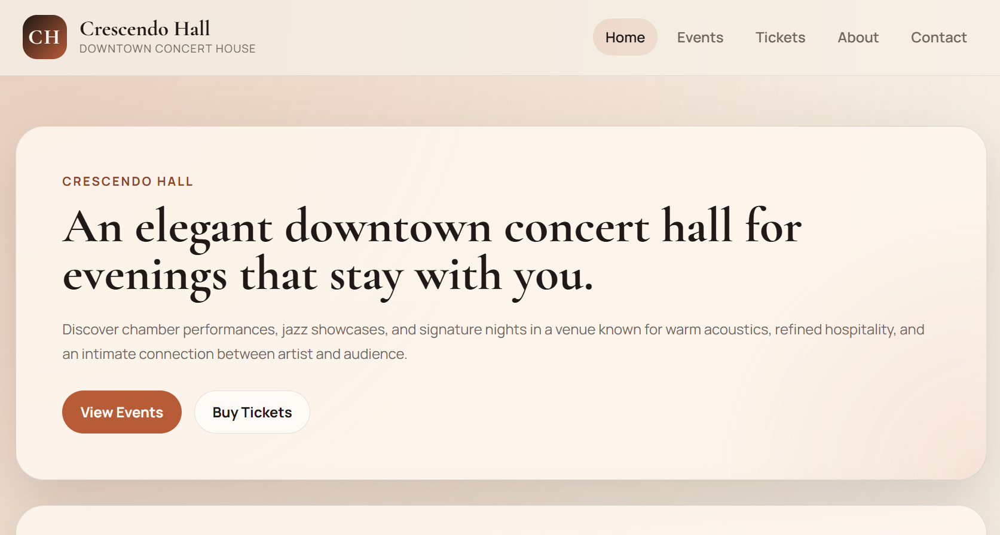
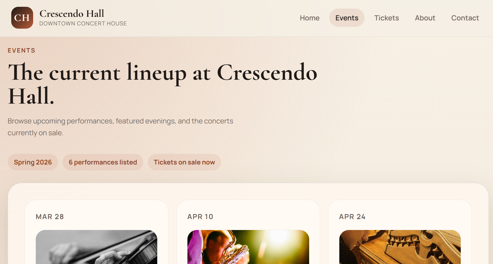
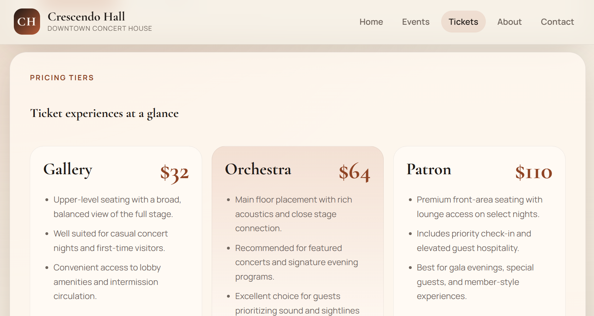
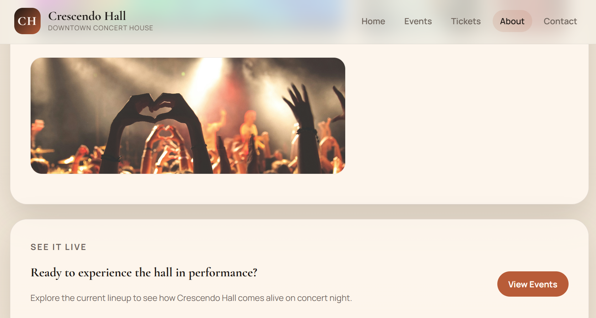
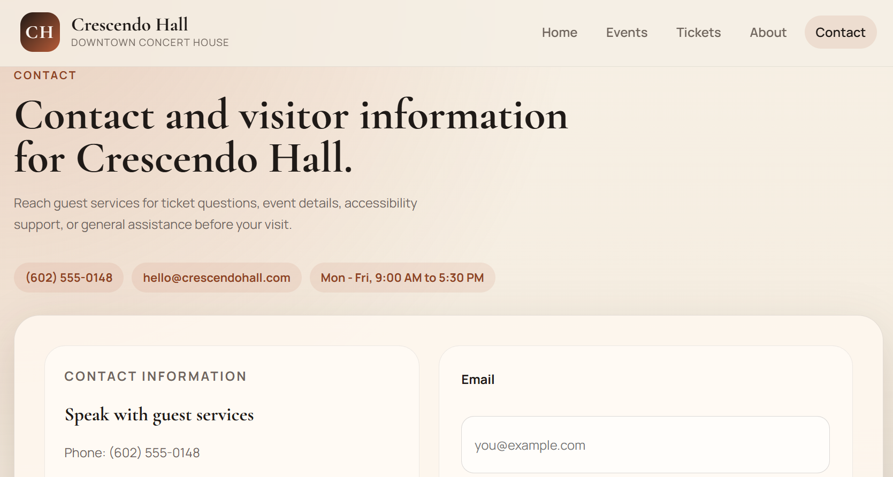

# Crescendo Hall Event Center Website

## Project Purpose

The goal of this project was to build a professional multi page website for a fictional concert venue. 

The site demonstrates how HTML and CSS can be used to structure content, design reusable layouts, and create an engaging user experience for an event based business.

Key concepts practiced include:

- Semantic HTML structure
- Multi page navigation
- CSS Grid and Flexbox layouts
- Component style design patterns
- Clean and consistent UI styling

# Website Preview

## Home Page

The homepage introduces Crescendo Hall and highlights featured performances with clear calls to action for viewing events or purchasing tickets.

## Events Page

The events page displays upcoming performances using a structured card layout that includes dates, images, and performance information.

## Tickets Page

The tickets page presents seating tiers and pricing options, allowing visitors to quickly compare ticket experiences.

## About Page

The about page explains the venue’s atmosphere, design philosophy, and the type of performances hosted at Crescendo Hall.

## Contact Page

The contact page provides visitor information and includes a contact form for guest inquiries.

# Project Features

- Multi page website structure
- Semantic HTML layout
- Responsive design using CSS Grid and Flexbox
- Event card layout for upcoming performances
- Ticket pricing tiers
- Contact form for visitor inquiries
- Navigation system connecting all pages
- Reusable CSS styling system
- Consistent visual design and typography

# Pages Included

- **Home**: Introduces the venue and highlights featured events.
- **Events**: Displays upcoming concerts with a card based layout.
- **Tickets**: Shows ticket pricing tiers and seating descriptions.
- **About**: Explains the venue concept and atmosphere.
- **Contact**: Provides guest services information and a contact form.

# Technologies Used

**HTML5**

- Semantic elements
- Structured page layouts
- Multi page navigation

**CSS3**

- CSS Grid for page layouts
- Flexbox for navigation and alignment
- Reusable styling patterns
- Custom buttons and card components
- Consistent spacing and typography

# How to run

1. Clone the repository: https://github.com/Sean-MacNabb/Event_Center_Website_Assignment.git
2. Open 'index.html' in your browser or run using a local development server

# Potential Future Enhancements

- Mobile specific responsive breakpoints
- JavaScript powered event filtering
- Dynamic event data loading
- Ticket purchasing flow
- Animation and micro interactions